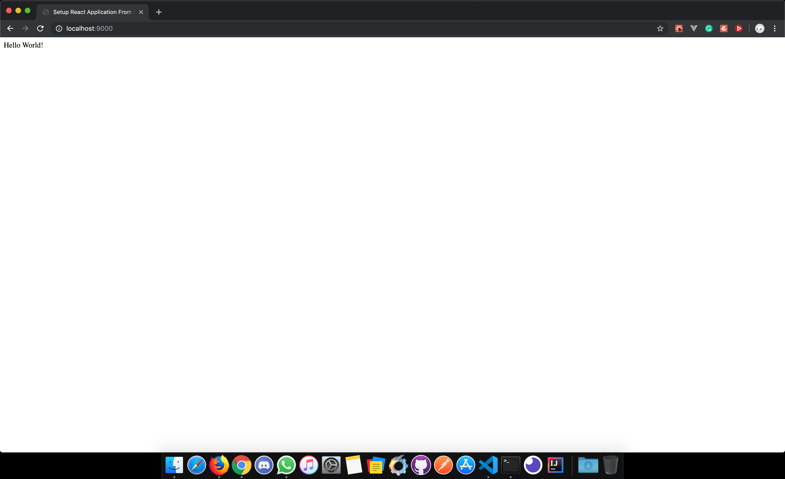

After dwelling in [Ember.js](https://www.emberjs.com) for almost two years I have tried [React.js](https://reactjs.org/). As every developer do, I started surfing on the internet to create my Hello World app using _React.js_. 

Initially, I found [create-react-app](https://reactjs.org/docs/create-a-new-react-app.html) which is pretty much useful for creating _React.js_ in lightning-fast speed. I really enjoyed _create-react-app_ since it had all the setup that we usually need in JS framework, starting from development server to test setup.

After using it for a while I felt that it lacks customization. _create-react-app_ uses [Webpack](https://webpack.js.org/) behind the screen to build the application. Webpack is a widely used javascript bundler which has a large ecosystem that supports plenty of plugins. But _create-react-app_ doesn't allow us to explore those plugins. 

So I arrived at the conclusion that I need to move out of _create-react-app_ to utilize the full power of _webpack_ with _React.js_. I started writing my own webpack configuration to release the full power of webpack.

Here I'm writing how I used webpack to build my react application to help the developers like me.  

### Prerequisite

* _Node.js_ must be installed on your computer. I hope you guys are familiar with [yarn](https://yarnpkg.com/lang/en/). Also, _yarn_ is installed globally.
* Create an empty project and create a _package.json_ file.  
  
  
### Installation

Install the following packages.

#### Setup React.js

```shell
yarn add react and react-dom
```

_react_ - React.js library.  
_react-dom_ - This package serves as the entry point to the DOM and server renderers for React.  
  
  
#### Setup webpack

```shell
yarn add -D webpack webpack-cli webpack-dev-server html-webpack-plugin
```  

_webpack_ - Webpack is a bundler for modules.  
_webpack-cli_ - Command Line interface for webpack.  
_webpack-dev-server_ - Development server that provides live reloading.  
_html-webpack-plugin_ - The HtmlWebpackPlugin simplifies creation of HTML files to serve your webpack bundles.  

#### Setup Babel

```shell
yarn add -D @babel/core @babel/preset-env @babel/preset-react babel-loader
```  

_@babel/core_ - Mainly used to convert ECMAScript 2015+ code into a backwards compatible version of JavaScript.  
_@babel/preset-env_ - @babel/preset-env allows you to use the latest JavaScript.  
_@babel/preset-react_ - This package is a set of plugins used to support React.js specific features.  
_babel-loader_ - This package allows transpiling JavaScript files using Babel and webpack.    
  
### Configuration

We have installed all the required packages to create a _React.js_ application using _webpack_. Next we need an _index.html_ template where we need to insert the react constructed dom. Create an HTML file inside _src/_ folder.  

_src/index.html_
```html
  <html>
    <head>
      <title>Setup React Application From Scratch</title>
    </head>
    <body>
      <!-- We will insert the dom here -->
      <div id="react-app">

      </div>
    </body>
  </html>
```


Also, we need a starting point to create react application. Create a js file index _src/_ folder.  

_src/index.js_ 
```js
  import React from 'react';
  import { render } from 'react-dom';

  const rootElement = document.getElementById('react-app');

  render(<div> Hello World! </div>, rootElement);
```

Configure webpack to serve live development server

_webpack.config.js_
```js
  const path = require('path');
  const HtmlWebpackPlugin = require('html-webpack-plugin');

  module.exports = {
    entry: path.resolve(__dirname, 'src/index'),
    output: {
      path: path.resolve(__dirname, 'dist'),
      filename: 'bundle.js'
    },
    module: {
      rules: [{
        test: /\.js$/,
        include: path.resolve(__dirname, 'src'),
        use: ['babel-loader']
      }]
    },
    devServer: {
      contentBase:  path.resolve(__dirname, 'dist'),
      port: 9000
    },
    plugins: [
      new HtmlWebpackPlugin({
        template: "src/index.html" //source html
      })
    ]
  };
```


Babel Configurations

_.babelrc_
```js
{
  "presets" : [
    "@babel/preset-env",
    "@babel/preset-react"
  ]
}
``` 
  
We have reached to the finishing line. Oh wait! there is one more thing to be done. Add the _webpack_ scripts to _package.json_ file.


_package.json_
```json
{
  "name": "react-setup-from-scratch",
  "scripts": {
    "serve": "webpack-dev-server --mode development",
    "build": "webpack --mode production",
  }
}
```


That's all! It's show time. Let's start the development server.

```shell
  yarn serve
```  
  
Voila!!! We are done. Let's see the output.



I hope this post is useful in someway for the beginners ❤️. 


 


