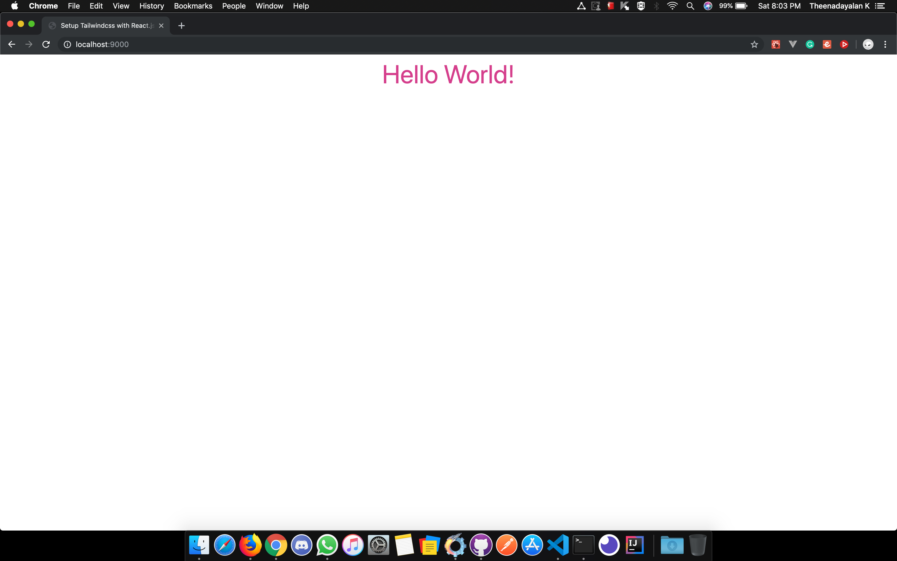
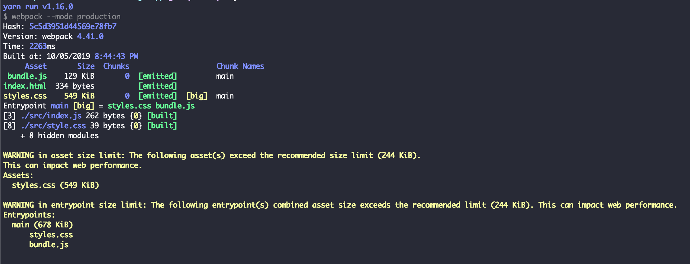
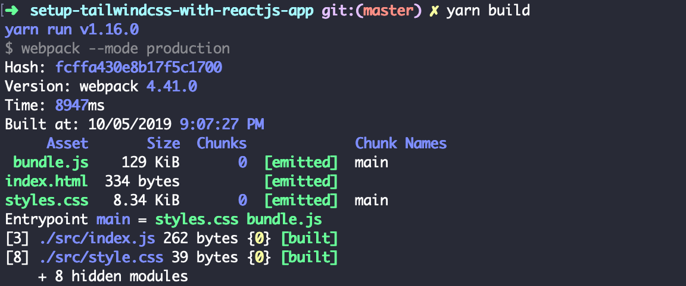

[TailwindCSS](https://tailwindcss.com/) is a _utility-first_,  _highly customizable_, _low-level_ CSS framework that gives you all of the building blocks you need to build bespoke designs without any annoying opinionated styles you have to fight to override.

Every Web developer in the world is using [Bootstrap](https://getbootstrap.com/) as their first front-end component library. Because it is simple and easy to build the CSS components with a few bootstrap classes. They will be in flying colors because they have built Dropdown, Navbar, Tooltip, etc using a few CSS classes. 

The real problem comes once they start introducing custom design(styles). They will have to override many _Bootstrap_ CSS classes to make up their custom designs. Here TailwindCSS has the advantage over bootstrap, it has all the utility classes to build our custom design. It is also having component classes for starter projects.

> _Bootstrap_ is also having utility classes, but they are very few. and non-customizable. TailwindCSS is a fully customizable and low-level CSS framework.

In this post, We are going to explore how to setup _TailwindCSS_ with _React.js_ application using [Webpack](https://webpack.js.org/) and [PostCSS](https://postcss.org/). 

### Prerequisites

Before adding _TailwindCSS_ into your project, you must not be using _create-react-app_ since we are gonna do manual _Webpack_ configuration which _create-react-app_ restricts. You should be built the project from scratch.

>If you are new to _React.js_, Please follow my [previous post](https://www.theenadayalan.me/blog/setup-reactjs-from-scratch) on setting up the _React.js_ application from scratch.

### Installation

Follow the below steps to install the required packages to add _TailwindCSS_ to your _React_ application.

#### Setting up TailwindCSS

First, we will learn how to add _TailwindCSS_ to the project using _Webpack_ and _PostCSS_.

Install _TailwindCSS_ and _PostCSS_.

```shell
  yarn add tailwindcss
```

_tailwindcss_ - TailwindCSS library

Import the _TailwindCSS_ library styles into our application style.

_src/style.css_

```css
  @tailwind base;
  @tailwind components;
  @tailwind utilities;
```

```shell
  yarn add -D postcss postcss-loader css-loader mini-css-extract-plugin
```

_postcss_ - CSS transformation tool.  
_css-loader_ -  Interprets _@import_ and _url()_ like _import/require()_.  
_mini-css-extract-plugin_ - Extracts CSS into separate files, say _style.css_.  
_postcss-loader_ - PostCSS loader for webpack.  

Let's add the webpack configurations.

_webpack.config.js_

```javascript
const path = require('path');
const HtmlWebpackPlugin = require('html-webpack-plugin');
const MiniCssExtractPlugin = require("mini-css-extract-plugin");

module.exports = {
  entry: path.resolve(__dirname, 'src/index'),
  output: {
    path: path.resolve(__dirname, 'dist'),
    filename: 'bundle.js'
  },
  module: {
    rules: [{
      test: /\.js$/,
      include: path.resolve(__dirname, 'src'),
      use: ['babel-loader']
    }, {
      test: /\.css$/,
      use: [
        {
          loader: MiniCssExtractPlugin.loader
        },
        'css-loader',
        'postcss-loader'       
      ]
    }]
  },
  devServer: {
    contentBase:  path.resolve(__dirname, 'dist'),
    port: 9000
  },
  plugins: [
    new MiniCssExtractPlugin({
      filename: "styles.css"
    }),
    new HtmlWebpackPlugin({
      template: "src/index.html" //source html
    })
  ]
};
```

let's add the _PostCSS_ configurations.

_postcss.config.js_

```js
module.exports = {
  plugins: [
    require('tailwindcss')
  ]
}
```

That's all! We are done. It's testing time. Let's add some tailwindcss styles to our project.

_src/index.js_

```js
import React from 'react';
import { render } from 'react-dom';
import './style.css';

const rootElement = document.getElementById('react-app');

render(<div className="text-pink-600 text-center text-5xl"> Hello World! </div>, rootElement);
```

Phewww!! Let's see what we have done.



See! Very simple right?

Here comes the real villain, **Let's check the Bundle Size**



The size of the CSS file is _**549KB**_. We used only a few classes but the bundle includes all the CSS classes that we don't actually use. (maybe we will never use it). Here comes the [PurgeCSS](https://www.purgecss.com/) as a lifesaver. 

### Setup PurgeCSS

[PurgeCSS](https://www.purgecss.com/) is a tool to remove unused CSS. We need to configure it with our PostCSS tool to get the benefit of PurgeCSS.

```shell
  yarn add -D @fullhuman/postcss-purgecss
```

[@fullhuman/postcss-purgecss](https://github.com/FullHuman/postcss-purgecss) - PostCSS plugin for purgecss

Configure _postcss.config.js_ to support PurgeCSS.

_postcss.config.js_

```js
const purgeCSS = require('@fullhuman/postcss-purgecss');

module.exports = {
  plugins: [
    require('tailwindcss'),
    purgeCSS({
      content: [
        './src/**/*.js',
      ],
      css: ['./src/**/*.css']
    })
  ]
}
```

That's all for the configurations. Now check the build size.



From **549KB** to **8.34KB**. 

**98.4%** of CSS got reduced by Adding PurgeCSS 😃.

Fully completed code can be found [here](https://github.com/theenadayalank/setup-tailwindcss-with-reactjs-app).

I hope this post is useful in some way for others. ❤️
